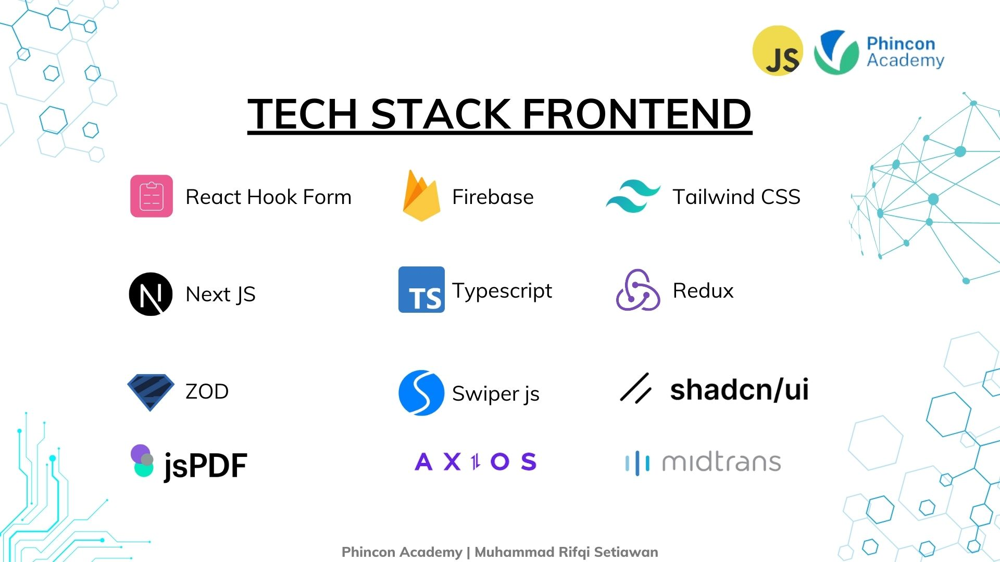

# 🎮 Tiara Games - Frontend 🎮


Tiara Games is a user-friendly frontend web application for purchasing game top-ups, designed with scalability and performance in mind. This project leverages modern web technologies and tools to deliver a seamless user experience, including a robust admin interface for efficient management.

# 🧾 Table of Contents

- [🧑🏻‍💻 Author](#-author)
- [🛠️ Tech Stack](#️-tech-stack)
  - [Core Frameworks & Language](#core-frameworks--language)
  - [Styling](#styling)
  - [State Management](#state-management)
  - [API & Utilities](#api--utilities)
  - [Features](#features)
- [📁 Project Structure](#project-structure)
- [🌟 Features](#features-1)
  - [🙍🏽 User Features](#-user-features)
  - [👷🏽 Admin Features](#-admin-features)
- [🌐 Environment Variables](#environment-variables)
- [🚀 Getting Started](#getting-started)
- [🤝 Contribution](#contribution)
- [🔧 Backend Repository](#backend-repository)
- [🔗 Live Preview](#live-preview)
- [📝 License](#license)

## 🧑🏻‍💻 Author

- [@Qois Abdul Qudus](https://github.com/qoisabd) as Full Stack Developer.

## 🛠️ Tech Stack



### Core Frameworks & Language

- [Next.js](https://nextjs.org/) Framework for building fast, server-rendered React applications with excellent SEO capabilities.
- [TypeScript](https://www.typescriptlang.org/) strong typing, improved developer experience, and catching errors during development.

### Styling

- [Tailwind CSS](https://tailwindcss.com/) A utility-first CSS framework for rapidly building custom designs.
- [ShadCN-UI](https://ui.shadcn.com/) Pre-built and customizable components for consistent styling.

### State Management

- [Redux](https://redux.js.org/) A predictable state container for JavaScript apps.
- [Redux Toolkit](https://redux-toolkit.js.org/) A powerful and opinionated Redux setup to simplify state management.

### API & Utilities

- [Axios](https://axios-http.com/) Promise-based HTTP client for making requests to the server.
- [ZOD](https://zod.dev/) Schema validation and TypeScript-first validation library.
- [React Hook Form](https://react-hook-form.com/) Performant, flexible, and extensible forms with easy-to-use validation.

### Features

- [Firebase](https://firebase.google.com/) A comprehensive platform for building web and mobile applications.
- [Midtrans](https://midtrans.com/) Payment gateway for seamless and secure transactions.
- [Swiper JS](https://swiperjs.com/) Modern mobile touch slider with hardware-accelerated transitions.
- [jsPDF](https://www.npmjs.com/package/jspdf) For generating PDF files dynamically.

## 📁 Project Structure

Here is the tree structure of the project:
frontend-top-up/

```bash
├── .next/ # Build files for Next.js (autogenerated)
├── app/ # Application-level pages and routes
├── components/ # Reusable UI components
├── features/ # Redux features and slices
├── hooks/ # Custom React hooks
├── lib/ # Helper libraries or utilities
├── node_modules/ # Dependencies (autogenerated)
├── public/ # Static assets
│ └── assets/ # Images and other public assets
├── store/ # Redux store configuration
├── types/ # TypeScript type definitions
├── utils/ # Utility functions
├── .env # Environment variables
├── .eslintrc.json # ESLint configuration
├── .gitignore # Git ignore rules
├── components.json # Component library configuration
├── global.d.ts # Global TypeScript definitions
├── middleware.ts # Private route middleware
├── next-env.d.ts # Next.js environment types
├── next.config.mjs # Next.js configuration
├── package-lock.json # Dependency tree (autogenerated)
├── package.json # Project metadata and dependencies
├── postcss.config.mjs # PostCSS configuration
├── README.md # Project documentation
├── tailwind.config.ts # Tailwind CSS configuration
└── tsconfig.json # TypeScript configuration
```

## 🌟 Features

### 🙍🏽User Features

1. Authentication

   - Sign In, Sign Up, Login with Google.
   - Forgot Password, Reset Password, Email Verification.

2. Transaction Management

   - Order With Midtrans Payment Gateway.
   - Live Check Transaction.
   - View Order History with order details.
   - Search orders in history.
   - Export individual order details to PDF.
   - Export complete order history to CSV.

3. Game Search
   - Search for games by name.
   - Display popular games on the homepage.

### 👷🏽Admin Features

1. Dashboard Overview

   - Display total transactions, total users, and total revenue.
   - Display the latest transactions and users.

2. User Management

   - View all users and their details.
   - Search users by name or email.
   - Add, Update user and delete users.
   - Export user data to CSV.

3. Product Management

   - View all products and their details.
   - Search products by name.
   - Add, Update product and delete products.
   - Export product data to CSV.

4. Category Management

   - View all categories and their details.
   - Search categories by name.
   - Add, Update category and delete categories.
   - Export category data to CSV.

5. Order Management
   - View all orders and their details.
   - Search orders by order ID or user email.
   - Export individual order details to PDF.
   - Export complete order history to CSV.

## 🌐 Environment Variables

This project uses the following environment variables:

```bash
    NEXT_PUBLIC_BACKEND_URL: # Backend API URL
    NEXT_PUBLIC_FIREBASE_API_KEY: # Firebase API Key
    NEXT_PUBLIC_FIREBASE_AUTH_DOMAIN: # Firebase Auth Domain
    NEXT_PUBLIC_FIREBASE_PROJECT_ID: # Firebase Project ID
    NEXT_PUBLIC_FIREBASE_STORAGE_BUCKET: # Firebase Storage Bucket
    NEXT_PUBLIC_FIREBASE_MESSAGING_SENDER_ID: # Firebase Messaging Sender ID
    NEXT_PUBLIC_FIREBASE_APP_ID: # Firebase App ID
    NEXT_PUBLIC_FIREBASE_MEASUREMENT_ID: # Firebase Measurement ID
    NEXT_PUBLIC_MIDTRANS_CLIENT_KEY: # Midtrans Client Key
    NEXT_MIDTRANS_SNAP_URL: # Midtrans Snap URL
    NEXT_JWT_SECRET_KEY: # JWT Secret Key
    NEXT_PUBLIC_COOKIE_NAME: # Cookie Name
```

## 🚀 Getting Started

### 1. Clone the repository

```bash
git clone https://github.com/qoisabd/tiara-frontend.git
cd tiara-frontend
```

### 2. Install dependencies

```bash
npm install
```

### 3. Set up environment variables

Create a .env file at the root directory and configure Firebase, Midtrans, and other required keys. You can use the .env.example file as a reference.

### 4. Run the development server

```bash
npm run dev
```

Open [http://localhost:3000](http://localhost:3000) with your browser to see the result.

## 🤝 Contribution

### 1. Fork the repository

### 2. Clone the repository

```bash
git clone
```

### 3. Create a new branch

```bash
git checkout -b feature/branch-name
```

### 4. Make changes

### 5. Commit your changes

```bash
git commit -m 'Add some feature'
```

### 6. Push to the branch

```bash
git push origin feature/branch-name
```

### 7. Submit a pull request

### 8. Thank you for your contribution!

## 🔧 Backend Repository

The backend repository for this project can be found [here](https://github.com/doelkussoy/backend-tiara.git/)

## 🔗 Live Preview

Check out the live preview of the project [here](https://tiaragames.netlify.app/).

## 📝 License

This project is licensed under the MIT License - see the [LICENSE](LICENSE) file for details.
